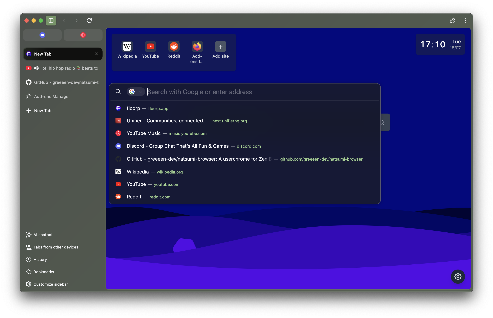
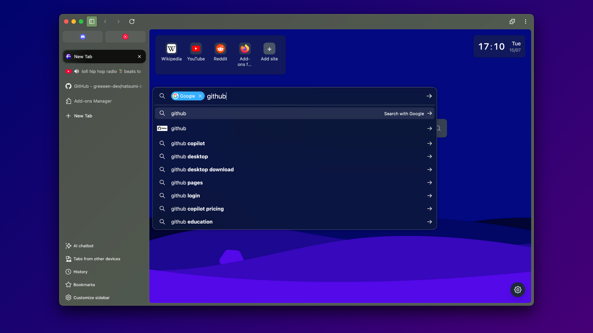
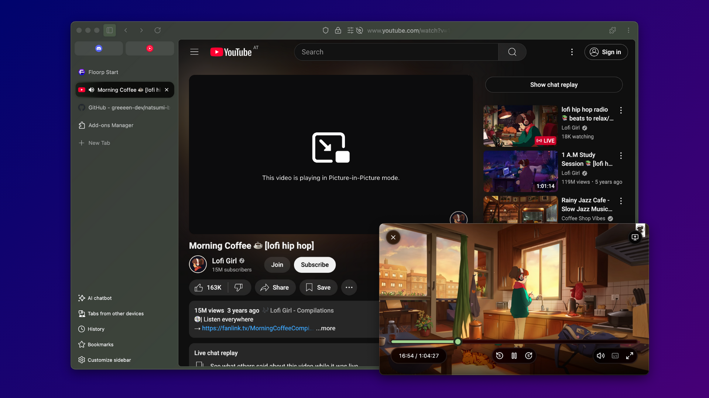
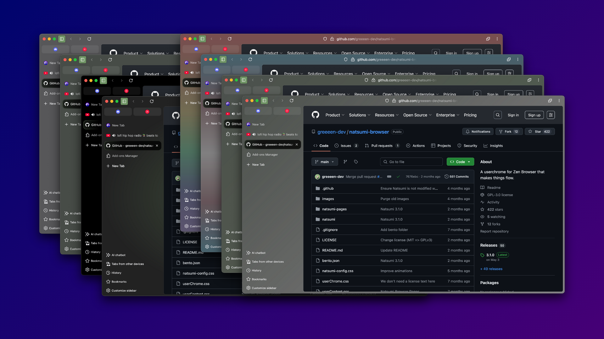
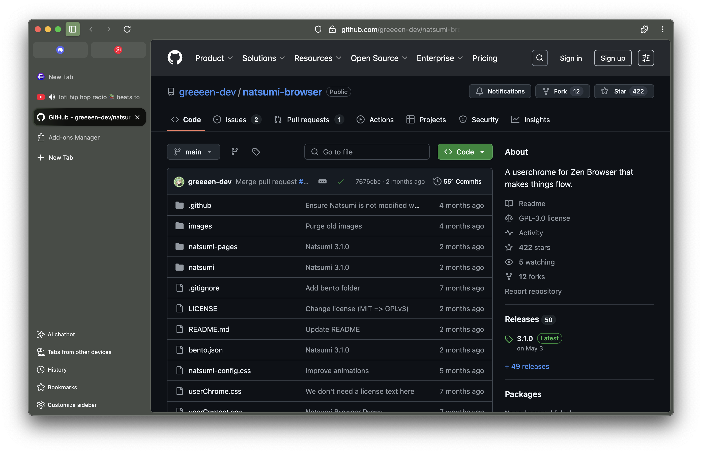
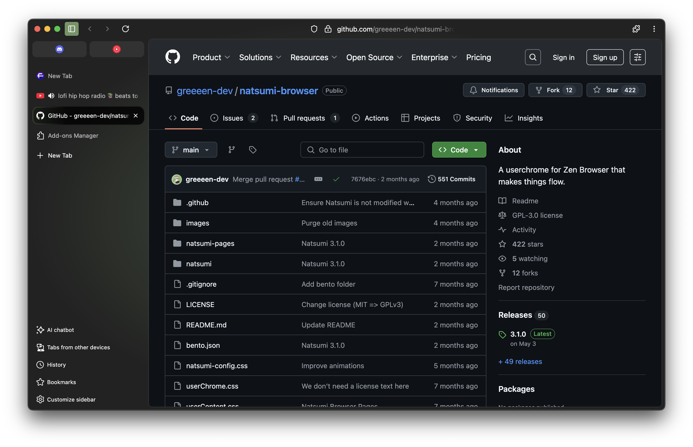
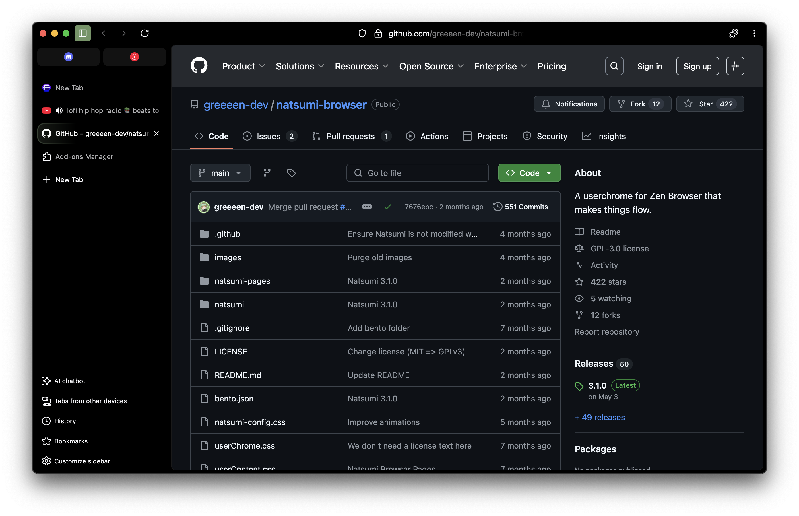
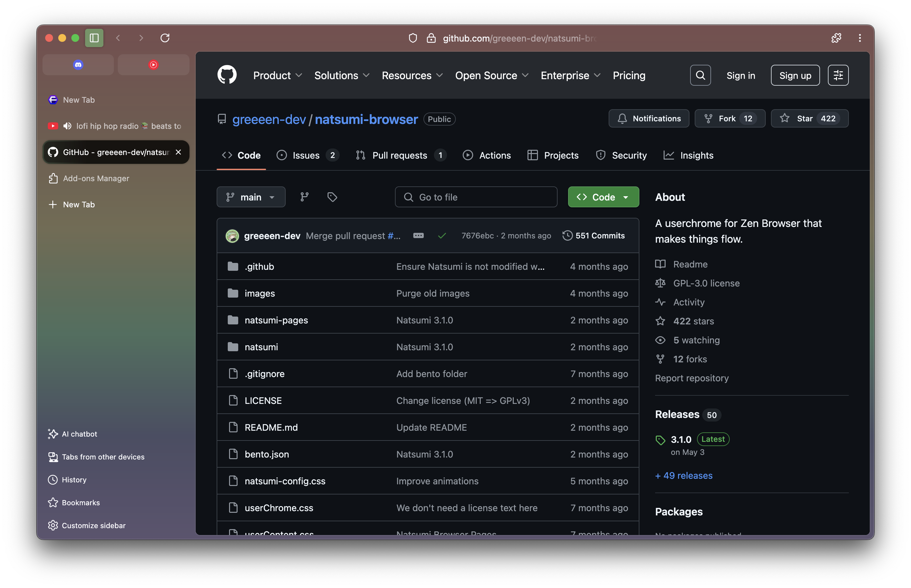
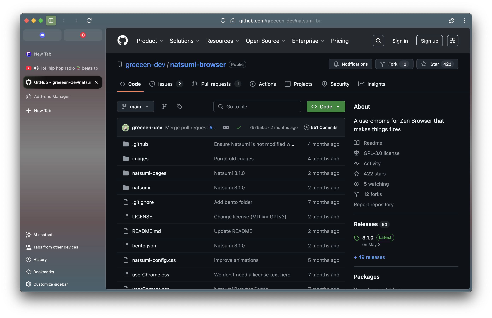
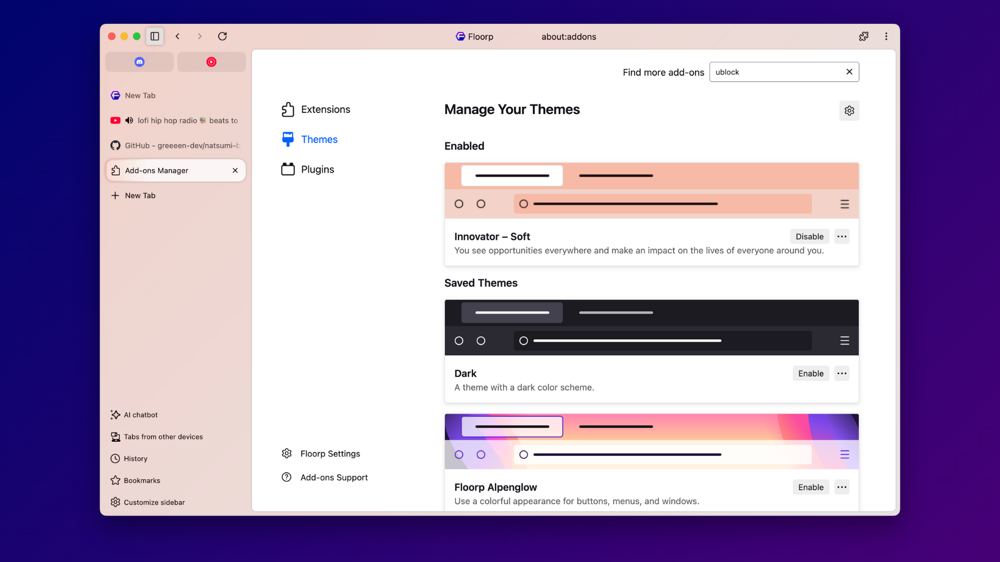

<h1 align="center">
  
   
  Natsumi Browser
</h1>

  A skin for Firefox and its forks that makes things <strong><i>~flow~</i></strong>.

## Meet Natsumi! 🦋
Natsumi Browser (or Natsumi, for short) is a skin made for Firefox and its forks that adds lots of
polish to the design by incorporating animations, blurs and more. It's pretty much the skin I
personally use, but made public because people wanted the CSS.

Natsumi is NOT a standalone browser. I don't even intend on making one.

> [!NOTE]
> Please remember that Natsumi in the end is **my personal browser skin**. If you don't like a design
> choice I've made, chances are I'll keep it if I still like it. So please be respectful and refrain
> from attacking people when you make suggestions. Thanks!

## Features
### ✨ Your browser, reimagined.
#### The classic Firefox design but with a modern spin.

Natsumi keeps your browser's design familiar while adding a modern touch to it.

### ⌨️ URL bar, made intuitive.
#### Highlights the current URL and adapts to the scene.

Natsumi URLbar is a new take on your browser's address bar, which highlights the current URL and
changes appearance based on the context.

### 🖥️ Reimagined Picture-in-picture.
#### Modern and streamlined.

Natsumi's Picture-in-picture adds a more modern look to Firefox's PiP to make it more consistent with
the rest of the browser.

### 📄 PDF viewer, modernized.
#### View your documents in the 21st century.

Give Firefox's PDF viewer a fresh coat of paint! Natsumi includes tweaks for the default PDF viewer,
giving it the modern look it really deserves. And with compact view, you can focus on the file at
hand when you don't need the extra tools.

### 🖼️ Express yourself with themes.
#### A theming engine that lets your browser vibe with you

Let your browser be yours! Choose from eight theme varieties to get the look that resonates with you.

- **Default (default)**
  
  No changes, just the default look.
  
- **Gradient (`gradient`)**
  
  A light gradient of the accent color, similar to my Zen Browser gradient.
  
- **Complementary Gradient (`gradient-complementary`)**
  
  A gradient of the accent color and its opposite color, similar to Zen Browser's gradients.
  
- **Colorful Solid (`colorful`)**
  
  A solid color with a tint of the accent color.
  
- **Lucid (`lucid`)**
  
  A recreation of the Zen Dream and Zen Galaxy themes.
  
- **OLED (`oled`)**
  
  A completely black and white theme for the minimalists and OLED users.
  
- **LGBTQ 🏳️‍🌈 (`lgbtq`)**
  
  Browsing with pride!
  
- **Transgender 🏳️‍⚧️ (`transgender`)**
  
  Trans rights are human rights!
  

### 🎨 And color it all your way.
#### Firefox themes support, still there.

Don't like the default colors? Install a Firefox theme and Natsumi will adjust its colors for you.

Or, choose from one of the preset colors.

- $${\color{#a0d490}■}$$ **Light green** (default) - #a0d490
- $${\color{#aac7ff}■}$$ **Sky blue** (`sky-blue`) - #aac7ff
- $${\color{#74d7cb}■}$$ **Turquoise** (`turquoise`) - #74d7cb
- $${\color{#dec663}■}$$ **Yellow** (`yellow`) - #dec663
- $${\color{#ffb787}■}$$ **Peach Orange** (`peach-orange`) - #ffb787
- $${\color{#ff9eb3}■}$$ **Warmer Pink** (`warmer-pink`) - #ff9eb3
- $${\color{#dec1b1}■}$$ **Beige** (`beige`) - #dec1b1
- $${\color{#ffb1c0}■}$$ **Light Red** (`light-red`) - #ffb1c0
- $${\color{#ddbcf3}■}$$ **Muted Pink** (`muted-pink`) - #ddbcf3
- $${\color{#f6b0ea}■}$$ **Pink** (`pink`) - #f6b0ea
- $${\color{#d4bbff}■}$$ **Lavender Purple** (`lavender-purple`) - #d4bbff

## Installation
You will need to install Natsumi by copying its files to your profile's chrome folder.

### Natsumi Browser
#### If you already have a userChrome.css/userContent.css file
1. Copy natsumi-config.css and natsumi folder to your chrome folder.
2. Add `@import "natsumi/natsumi.css";` to the beginning of your userChrome.css file. 
3. Add `@import "natsumi/natsumi-pages.css";` to the beginning of your userContent.css file.
4. Restart your browser and enjoy!

#### If you don't have a userChrome.css/userContent.css file
1. Create a new chrome folder in your profile folder, if you haven't already.
   ([guide](https://docs.zen-browser.app/guides/live-editing))
2. Copy userChrome.css and userContent.css to the chrome folder.
3. Copy natsumi-config.css and natsumi folder to the chrome folder.
4. Restart your browser and enjoy!

## Browser configs (in about:config)
These are the configs you can use to tweak Natsumi Browser. If you want to tweak the animation duration
and delay, change the variables in the config.css file.

### 🎨 Theming
- `natsumi.theme.type` (string): Sets the browser theme type.
  - Enter a theme ID from the themes list in the [Features](#features) section.
- `natsumi.theme.accent-color` (string): Sets the browser theme color from a given accent color.
  - Enter a color ID from the colors list in the [Features](#features) section.
- `natsumi.theme.force-natsumi-color` (boolean): Forces Natsumi's accent color set in natsumi-config.css
  to be used instead of the current Firefox theme's colors.
- `natsumi.theme.use-tab-theme-color` (boolean): Uses the tab border color as the accent color for Blade.
  This may break Blade on some themes.
- `natsumi.theme.disable-translucency` (boolean): Disables the translucency effect.
- `natsumi.theme.gray-out-when-inactive` (boolean): Grays out the browser when inactive.

### 🗂️ Tabs
- `natsumi.tabs.use-custom-type` (boolean): Enables custom tab types. Blade is used when this is disabled.
- `natsumi.tabs.type` (string): Sets a custom tab type.
  - `material`: A material-like design inspired by Zen Browser's alpha UI.

### ⌨️ URL bar
- `natsumi.urlbar.disabled` (boolean): Disables URL bar tweaks.
- `natsumi.urlbar.do-not-float` (boolean): Disables the floating URL bar.
- `natsumi.urlbar.always-expanded` (boolean): Disables the compact URL bar when inactive.

### 🔎 Findbar
- `natsumi.findbar.disabled` (boolean): Disables Natsumi Findbar and reverts the findbar style back.
- `natsumi.findbar.disable-not-found-bg` (boolean): Disables red background that appears when there are no
  results.
- `natsumi.findbar.wider-findbar` (boolean): Increases maximum Findbar width back to 720px.

### 🖥️ Picture-in-Picture
- `natsumi.pip.disabled` (boolean): Disables Natsumi PiP and reverts the PiP style back.
- `natsumi.pip.native-border-radius` (boolean): Makes the PiP controls border radius look more native.
- `natsumi.pip.rounded` (boolean): Makes the PiP window round, like in macOS. Only supports Windows.
- `natsumi.pip.tinted-haze` (boolean): Uses Tinted Haze material instead of Haze.

### 📄 PDF Viewer
- `natsumi.pdfjs.disabled` (boolean): Disables Natsumi PDF Viewer and reverts the PDF viewer back.
- `natsumi.pdfjs.compact` (boolean): Enables compact mode for Natsumi PDF Viewer.
- `natsumi.pdfjs.compact-dynamic` (boolean): Disables compact mode when the PDF Viewer's sidebar is
  expanded.
- `natsumi.pdfjs.material` (string): Sets the material used in the PDF viewer elements. Glass is used when
  this is unset.
  - `haze`: Haze
  - `tinted-haze`: Tinted Haze

### 🏠 Firefox Home
- `natsumi.home.disabled` (boolean): Disables Natsumi FF home and reverts the FF home page back.
- `natsumi.home.custom-background` (boolean): Uses the custom background set in config as the home 
  screen background.

### 🔧 Compatibility
- `natsumi.browser.type` (string): Sets the browser type to enable browser-exclusive features and patches.
  - `firefox`: Mozilla Firefox
  - `floorp`: Floorp Browser

## FAQs
### "Can I use other userchromes with Natsumi?"
Sure! Just paste it right below the Natsumi Browser loader (userChrome.css) and you can use your own
userchrome alongside Natsumi Browser.

### "Can I disable individual features?"
You can disable some features using the configuration options.

If that doesn't help, you can remove certain modules (CSS files) from the natsumi.css file. However,
you will need to keep certain files (preload, postload, natsumi-config) for Natsumi to work properly.

> [!CAUTION]
> By modifying any part of Natsumi, you are responsible for any issues that may arise. If things do
> break, I will most likely not offer support for it.
> 
> If you installed Natsumi as part of another skin, your installation may be considered modified.
> Please check with the skin's developer for assistance in this case.

### "Is Natsumi compatible with Zen Browser?"
As of Natsumi v4, Natsumi has dropped all support for Zen Browser. I have no plans to continue
support whatsoever due to the browser's main developer's stance on personalization, as well as
various other reasons.

Additionally, it'd be a hassle to make things compatible with Zen, mainly because it is just so
heavily modified from the original Firefox that I may end up building a whole new skin just for
compatibility unintentionally.

### "When does Natsumi update?"
There is no fixed schedule for updates, it all happens randomly.

### "Is Natsumi compatible with non-Firefox-based browsers (Chrome, Arc, etc.)?"
No. Natsumi is made on top of Firefox, so it only supports Firefox and (most of) its forks.

If you try to apply Natsumi on Chrome/Chromium-based browsers like Arc, you can't apply
userchrome CSS files, making Natsumi completely incompatible with those browsers.

### "I don't like the design, please change it!"
If I like the design, nah. My personal skin, my rules.

### "Why is userChrome.css so empty?"
Natsumi Browser uses a system where the userChrome.css file acts as a loader that loads the skin,
instead of being the file that contains all rules. This way, it's easier for users to quickly enable
and disable custom CSS.

## Troubleshooting
### "URLbar blur won't work!"
Make sure both `layout.css.backdrop-filter.enabled` and `layout.css.backdrop-filter.force-enabled` are
set to true. Also make sure that you're using WebRender and hardware rendering.

### "I don't see any of the Natsumi options in about:config!"
These are custom options which you need to create. Type in the exact name, then press the plus button on
the right to create the config.

### "Something's bugged!"
There may be userchromes that you're using alongside Natsumi Browser that breaks things. Please disable
these then try again.

If the issue still persists, open an issue or report the bug to the developer through Discord.

### "Can I use your code for my browser?"
If your browser is open-source and licensed under the GPLv3 or later (or AGPLv3 or later), then yes.
Otherwise, please contact me so I can grant you permission. 

## Acknowledgements
Thank you to:
- [asev](https://github.com/lunar-os) for ZenCss, which served as the base for Natsumi Browser's base
  CSS for v1
- [vicky5124](https://github.com/vicky5124) for the Tab Groups CSS used until v2.4.0
- [AlexCookieDev](https://github.com/AlexCookieDev) for inspiring some of the animations I use in Natsumi
- [Lucide](https://lucide.dev/) for the icons used in Natsumi for Floorp ([view
  license](./natsumi/icons/lucide/LICENSE))

## Disclaimer
THE SOFTWARE IS PROVIDED "AS IS", WITHOUT WARRANTY OF ANY KIND, EXPRESS OR IMPLIED, INCLUDING BUT NOT
LIMITED TO THE WARRANTIES OF MERCHANTABILITY, FITNESS FOR A PARTICULAR PURPOSE AND NONINFRINGEMENT. IN NO
EVENT SHALL THE AUTHORS OR COPYRIGHT HOLDERS BE LIABLE FOR ANY CLAIM, DAMAGES OR OTHER LIABILITY, WHETHER
IN AN ACTION OF CONTRACT, TORT OR OTHERWISE, ARISING FROM, OUT OF OR IN CONNECTION WITH THE SOFTWARE OR
THE USE OR OTHER DEALINGS IN THE SOFTWARE.

All screenshots displayed in this README are accurate as of March 16, 2025. If a feature was added,
changed or removed after this date, it may not be accurately reflected in the screenshots.
